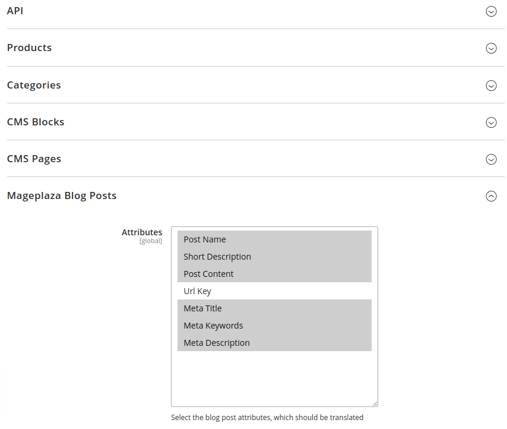
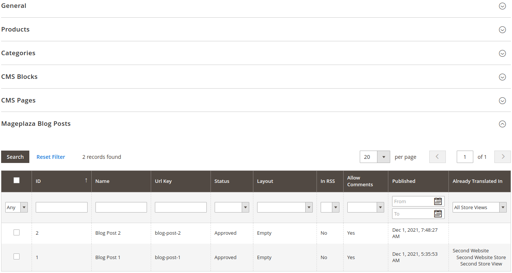

# Mageplaza Blog Compatibility Extension For The EasyTranslate Connector For Magento 2

This extension provides compatibility between
the [Mageplaza Blog extension](https://www.mageplaza.com/magento-2-better-blog/) and
the [EasyTranslate Connector For Magento 2](https://github.com/easytranslate-com/laas-api-magento-2-plugin).

## Description

This Magento 2 extension makes sure that you can also translate Mageplaza blog posts via EasyTranslate.

Please first check
the [README of the EasyTranslate Connector module](https://github.com/easytranslate-com/laas-api-magento-2-plugin/blob/main/docs/README.md)
to understand the whole process.

### Initial Configuration

This extension extends the configuration of the base extension by a "Mageplaza Blog Posts" group:

### Create Projects / Access Existing Projects

This extension extends the project edit page of the base extension by a "Mageplaza Blog Posts" fieldset:

## Compatibility

This extension is compatible with the latest supported versions of Magento 2.3 and Magento 2.4.

It may also be compatible with older versions, but we strongly recommend to only use up-to-date versions of Magento 2.

## Installation Instructions

The installation procedure highly depends on your setup. In any case, you should use a version control system like git
and test the installation on a development system.

### Composer Installation

1. `composer require easytranslate/m2-compat-mageplaza-blog`
2. `bin/magento module:enable EasyTranslate_CompatMageplazaBlog`
3. `bin/magento setup:upgrade`
4. `bin/magento setup:di:compile`
5. `bin/magento cache:flush`

### Manual Installation

1. Unzip the downloaded files.
2. Create the directory `app/code/EasyTranslate/CompatMageplazaBlog/`: `mkdir -p app/code/EasyTranslate/CompatMageplazaBlog/`
3. Copy the contents of the `src` directory from the unzipped files to the newly created directory `app/code/EasyTranslate/CompatMageplazaBlog/`.
4. `bin/magento module:enable EasyTranslate_CompatMageplazaBlog`
5. `bin/magento setup:upgrade`
6. `bin/magento setup:di:compile`
7. `bin/magento cache:flush`

## Uninstallation

The uninstallation procedure depends on your setup:

### Uninstallation After Composer Installation

1. `bin/magento module:uninstall EasyTranslate_CompatMageplazaBlog`
2. `bin/magento setup:di:compile`
3. `bin/magento cache:flush`

### Uninstallation After Manual Installation

1. `bin/magento module:disable EasyTranslate_CompatMageplazaBlog`
2. `bin/magento setup:di:compile`
3. `bin/magento cache:flush`
4. `rm -r app/code/EasyTranslate/CompatMageplazaBlog/`

## Support

If you have any issues with this extension, feel free to open an issue
on [GitHub](https://github.com/easytranslate-com/laas-api-magento-2-compat-mageplaza-blog/issues).

## Licence

[Open Software License 3.0](https://opensource.org/licenses/OSL-3.0)

## Copyright

&copy; 2021 EasyTranslate A/S
